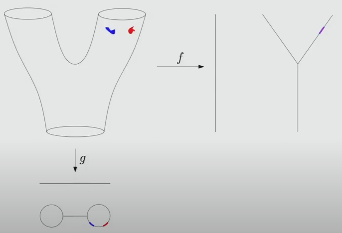
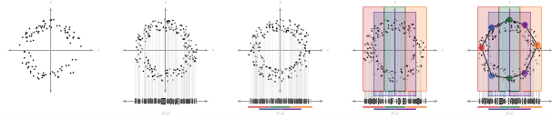
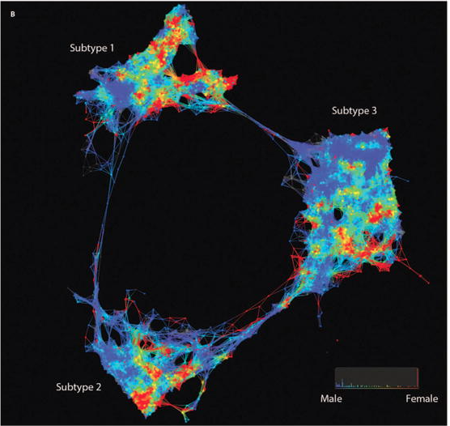
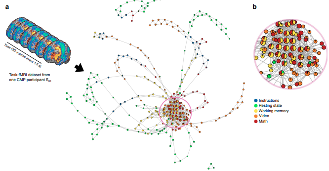

# TDA (Mapper篇)
這篇主要針對拓樸資料分析中的Mapper Algo進行討論，理解Mapper的設計原理以及優勢，並介紹該方法的幾個範例。預設讀者對拓樸資料分析有初步認識，但還是會簡單帶過概念。

## 拓樸資料分析在做甚麼
該方法在醫療、交通、環境及氣候等都有所貢獻，且近期在不斷的增加，而他所做的是尋找資料的**形狀**，形狀重要的點在於當你理解了一筆資料的形狀後，將可以在嵌入一個資料點時回推其狀態。下圖是其中一個結構化資料範例進行Mapper壓縮(Mapper會在稍後進行解釋)，紅色和藍色點理解為他在有形狀的點雲中的特定資料點，但重點是不管你獲取了甚麼資料，都一定有形狀的存在，而當確認了該形狀進行分析後就可以知道每個區塊的資料代表了甚麼。

> 這是從[Standford Seminar](https://www.youtube.com/watch?v=x3Hl85OBuc0&t=3429s)獲取的圖像 
</img>

## 原理
通常在使用PCA的時候會想要再降低維度的同時保留重要的訊息，並且通過找出主成分來做進一步地作圖、分類或是聚類等等的分析，但是這樣的做法有幾個缺點:
1. 視覺化是使用PC的前幾個最大變異來作圖，雖然好的成分可以分割出不同的區塊，那麼壞的要怎麼解釋
2. 線性降維的結果可能損失重要資訊，小的變異可能也有有價值的結果

有一個方法可以減緩這樣的結果，那就是Mapper Algorithm，但首先要介紹一下Mapper的基本觀念在介紹其優勢。 
Mapper的步驟根據[該論文](https://www.sciencedirect.com/science/article/pii/S1532046422000983?ref=pdf_download&fr=RR-2&rr=87c89b378a4d8f1f)分為幾個點:
1. 找出較低維度映射函數進行映射
2. 找出Interval和Overlap
3. 回推到那些資料點是Inerval和Overlap
4. Cluster各資料點進行資料壓縮

</img>

映射函數可以是PCA、KDE、甚至Centrality等等的資料進行濾波，主要的作用為進行更有效率的計算，而Interval的作用為將資料設竟成好幾個區域，並且使用Overlap找出Interval和Interval之間的重疊比例，最終每個Interval會個別聚類形成節點，而Overlap會當作邊形成兩個節點之間的線，也就是該資料點同時在節點A又在節點B，這可以代表他同時擁有兩個類別的特性也是Mapper比較少被提及卻不應該被忽視的概念。

## 範例
最經典的例子不外乎就是[糖尿病子群體的分析](https://www.ncbi.nlm.nih.gov/pmc/articles/PMC4780757/)(1)，找出不同狀態下的糖尿病病患特徵，又或者是[MRI](https://www.nature.com/articles/s41467-018-03664-4.pdf)(2)這樣的圖像所降維得出的Mapper進行分析，都可以分析一筆資料所得出來的行狀以及形狀的群體。

1. </img>
2. </img>

## 結論
整體而言Maspper做出傳統分析方法較難以達成的點，也就是他不會預設你對於資料特徵的理解，而是先視覺化後再進行分析、能理解Unlabel資料分布型態、依照Mapper的流程可以了解該方法屬於非線性降低維度，做到了壓縮資料的效果，且有不少論文使用該方法找到節點後針對每個節點進行預測，做出了增強分類能力的作用，這篇是一個Mapper的簡單的介紹，更深入能探討的還有tsne和umap的比較，而拓樸的方式會在日後分享更多，例如時間序列的CROCKER plot、Zigzag persistence，以及很常討論的persistent homology的概念等等。

## 實例參考

An Introduction to Topological Data Analysis: Fundamental and Practical Aspects for Data Scientists. [link](https://www.frontiersin.org/journals/artificial-intelligence/articles/10.3389/frai.2021.667963/full) 
Identification of type 2 diabetes subgroups through topological analysis of patient similarity. [link](https://www.ncbi.nlm.nih.gov/pmc/articles/PMC4780757/) 
Topological data analysis in biomedicine: A review. [link](https://www.sciencedirect.com/science/article/pii/S1532046422000983?ref=pdf_download&fr=RR-2&rr=87c89b378a4d8f1f) 
Deciphering Active Wildfires in the Southwestern USA Using Topological Data Analysis. [link](https://www.mdpi.com/2225-1154/7/12/135) 
Towards a new approach to reveal dynamical organization of the brain using topological data analysis. [link](https://www.nature.com/articles/s41467-018-03664-4.pdf)