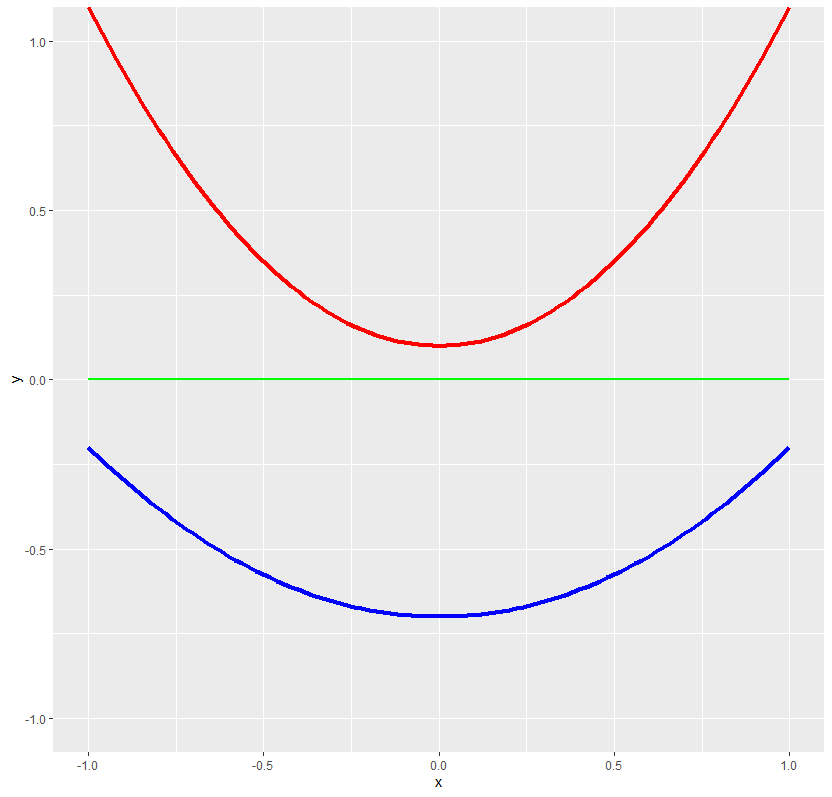
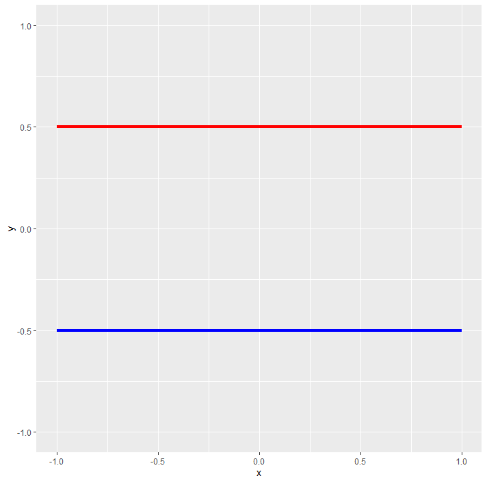
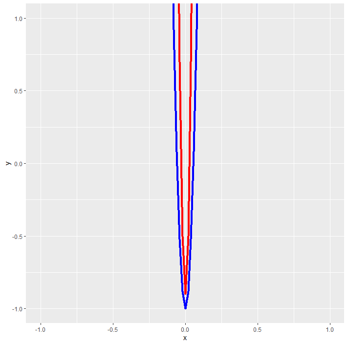
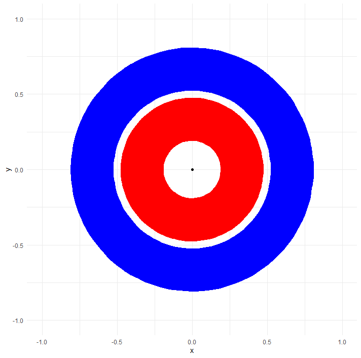

# 拓樸學在神經網絡的意義
> 文中引用大量[Colah](https://github.com/colah)的內容，這篇只是作為中文的整理推廣以及理解，[這裡](https://colah.github.io/)有更多他所寫的文章

> 這個筆記並非以數學的角度切入，而是盡量以大家都看得懂的方式帶入，所以上述如果有看不懂的下方例子都會舉例。

神經網絡在高維度的空間中是很難被視覺化的，也因此很難被理解其中的涵義或他做了甚麼，接下來會討論二維空間以及三維空間的視覺化以及他們和拓樸學的關聯。
首先要先了解拓樸學是甚麼，根據[Wiki](https://zh.wikipedia.org/zh-tw/%E6%8B%93%E6%89%91%E5%AD%A6)的內容可以得知它的基本性質有許多，而這裡會討論的性質包含:

1. **連通性 (Connectivity)**: 一個空間被稱為連通的，如果在該空間中的任意兩點之間都存在一條路徑，這條路徑完全包含於該空間之內。這意味著，無論選擇空間中的哪兩點，都可以通過空間內的一條連續路徑將它們連接起來。
2. **稠密性 (Density)**: 一個子集被認為是在其包含空間中稠密的，如果在該空間的任何一點的任何鄰域內，都至少可以找到一個該子集的元素。例如，在實數線上，有理數形成了一個稠密子集，這意味著無論你選擇實數線上的哪個區間，無論這個區間多麼小，你總能在其中找到至少一個有理數。
3. **同胚 (Homeomorphism)**: 同胚是一種特殊的函數，它建立了兩個拓撲空間之間的一一對應關係，且這種對應既連續又可逆，其逆映射也連續。同胚意味著兩個空間在拓撲意義上是完全相同的，即它們可以通過連續變形而相互轉換，而不會引入孔洞或者切割。
4. **連續映射 (Continuous Function)**: 連續映射是指一種函數，其中從一個拓撲空間到另一個拓撲空間的映射保持了點的鄰近關係。換句話說，如果在原始空間中的點足夠接近，那麼在目標空間中它們的像也是如此。這是拓撲學中描述空間之間關係的基本概念之一。
5. **同倫 (Homotopy)**: 同倫是一種表達兩個函數之間關係的概念，指的是一個函數可以通過連續變化（或“連續變形”）轉變為另一個函數的過程。在拓撲學中，如果兩個空間之間的函數是同倫的，這意味著它們在某種程度上是“相似的”，這種相似性是通過研究空間的拓撲性質來定義的。
6. **流形 (Manifold)**: 流形是一種幾何對象，其每一點的鄰域都與歐幾里得空間中的開集同胚。這意味著，雖然整體上流形可能具有複雜的形狀和拓撲結構，但在局部看來，它與我們熟悉的歐幾里得空間相似。流形是研究連續形狀、空間彎曲和維度概念的基礎。

上述先整理了等等會說到的專有名詞，除了**一般拓樸學**的性質外，還包含**代數拓樸、微分拓樸以及幾何拓樸**。在我看完wiki和一些介紹後，雖然上面提到很多專有名詞，但都像是連通以及稠密性質的延伸討論。

## 先上範例
通常在二維的空間中如果我們要區分兩個類，會在他們中間加上一條線來區分，那這張圖要怎麼去理解?
從該圖可以看到兩個不同的欄位變成xy軸，而且軸都是介於-1到1之間，也就是激活函數tanh所回傳的結果，所以該圖為兩個neuron，我們的目標是將兩個兩個維度所繪製出來的圖找出一個可將其分類的線。

</img>

而在每次的轉換過程中，或是稱為**仿射變換（affine transformation）**，圖形都會因此扭曲變形，那我們期望的是他們在每次的轉換後都會越拉越開，例如以下(當然實際情況似乎不可能出現這樣的圖型，應該是很扭曲然後被拉開的)

</img>

但是我們可能會遇到另一種方式的扭曲，這顯然不會是區分兩個類別的最佳解，因為他們在被擠壓之後都快黏在一起了。

</img>

### 更複雜的案例
你看到了一樣兩個類別的圖形，但是一般的線性顯然是沒辦法去將它區分開來的，如果是對於最終找尋超平面的sigmoid或softmax來說，其中的neuron應該要是3個，因為在二維平面(2 neuron)不管怎麼扭曲或拉伸都不會將他們分開。但是為甚麼呢?當每個層都是**同胚**或是W為奇異的時候，那麼A永遠都會圍繞在B的外側。

</img>

所以說如果我們將二維提升到三維，或是說增加一個neuron，那麼這個layer就被映射到三維圖像中了，並且被一個hyperplane所分類，這種感覺就像三維的svm做圖，為了找出超平面而新增了一個維度。

</img>

## Tanh 的拓樸
從上述可得知在經過每個activation時會擠壓或被拉開，卻不會被剪斷或被破壞，這種性質就是拓樸的基礎，而這種轉換不影響拓樸的概念就是**同胚**，Colah在文章中提到了一個定理: 有**N個欄位和N個輸出的層就稱為同胚**，其中**W為非奇異**(行列式不為零、存在逆矩陣)。

由上述給定的條件可得知W是一個具有逆矩陣的**bijective linear function**，也就是一個向量可映射到另一個向量的同時確保線性關係，所以說在任何輸入乘上W後也都會是同胚的，同時所有轉換以及**連續映射**都是同胚。

## 流行假設、同倫以及連結
流形假設是自然資料在其嵌入空間中形成低維流形且同時有實驗和理論去證實。所以說如果你同意這一點，分類演算法的任務根本上就是分離一堆糾結的流形，那麼有一個例子

</img>

在這個圖形中可以看到兩個連接的圓圈，所以說至少要在n+1也就是四維空間中才可以把它拆開，但是在現實生活中不一定所有的連結都是不可被解開的，但也不容易發現能否解開，而可以解開的結也就是三維就可解開的。這裡可以看到基本介紹[扭結理論(knot theory)](https://sites.oglethorpe.edu/knottheory/introduction/)。

### 簡單粗暴的方法
在我們不知道這種紐結是否可以被解開時，最簡單的方法就是將兩個結拉到最開，並且將連接的部分壓縮到最小值，或是理解成將組間放大的同時將組內縮小。

### 針對流行更好的層
根據Colah的文章，他提出了有趣的想法，也就是將K-NN作為最後一個層，那麼為什麼他會這麼想？其實跟拓墣也有關聯。從學習向量場或是移動**流形**的方向得知在一條線、一個平面或更高維的超平面會有地方被壓縮，或者被拉伸的部分，例如下圖密集的部分是被壓縮的，而一個一個的突起要怎麼去分類呢？就是k-NN！

</img>

Colah的在測試MNIST的數據嘗試兩層卷積網絡，無dropout並獲得1~2%誤差，在最後一層由Softmax改成k-NN則降到了0.1~0.2%。就結論而言雖然在測試時使用K-NN能夠從一些錯誤中恢復，但NN在本質上仍然在嘗試進行線性分類，所以並非最佳解。

使用knn在某方面可能是比較直覺，因為線性可分離對用NN可能是很困難的事(從上述遇到knot的問題就知道)，但是有個問題是他耗資源，但是**耗資源**是什麼意思？他又有什麼解法？

1. **前向傳播整個訓練集的問題**：在許多機器學習任務中，特別是在使用NN時，我們通常會將數據分成**小批量**來進行訓練，以提高計算效率並利用GPU處理。在使用k-NN作為分類器時，如果對於每一個小批量的數據，我們都需要考慮整個訓練集來找到最近鄰，這將導致極大的計算負擔，因為它需要大量的距離計算和比較。

2. **基於小批量內部分類的方法**：作者提出了一種解決方案，不是對每個小批量的數據點使用整個訓練集來進行k-NN分類，而是僅在當前小批量內進行分類。這樣，每個數據點的分類是基於它與小批量內其他數據點的距離，並根據距離的倒數給予權重，這大大減少了計算量。

3. **計算效率與準確率的權衡**：即使使用第二點的方式在計算上更有效率，但作者發現，使用k-NN層作為分類方法的準確率仍然不如傳統的深度學習模型，測試錯誤率只能降到5-4%，這比許多深度學習模型要差。此外作者還提到，即使在使用更複雜的模型架構下，結果也沒有顯著改善，而且在簡單架構下結果更差。

## 結論
這篇大部分是整理了一下Colah的文章然後稍微延伸，主要是想將有趣的文章推廣讓更多人知道，看這個文章前怎麼也不會想到拓墣在神經網絡的意義以及k-NN的解法，雖然這篇是2014年的現在一定也有更成熟的技術，這篇就當作一種學習NN和Topology的intro來讀吧！