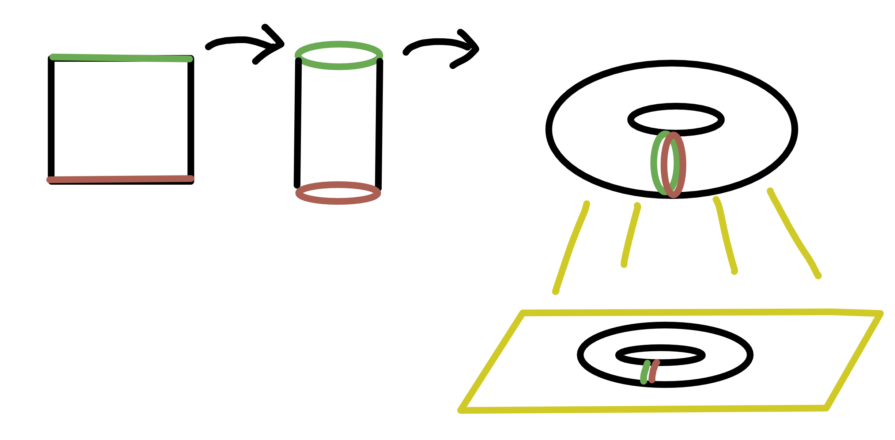
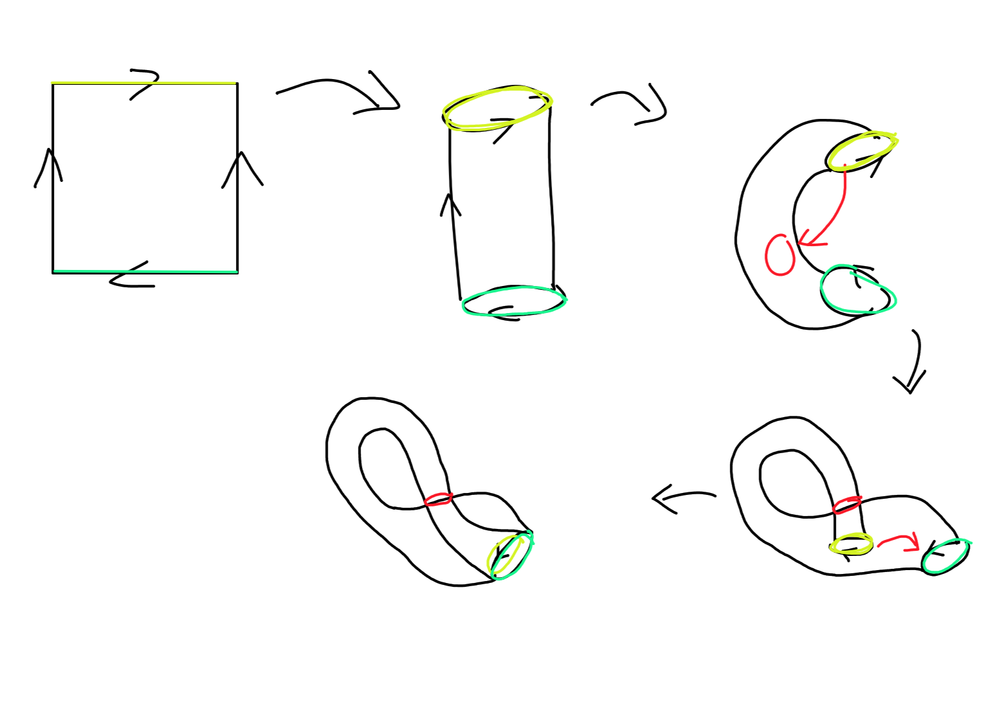
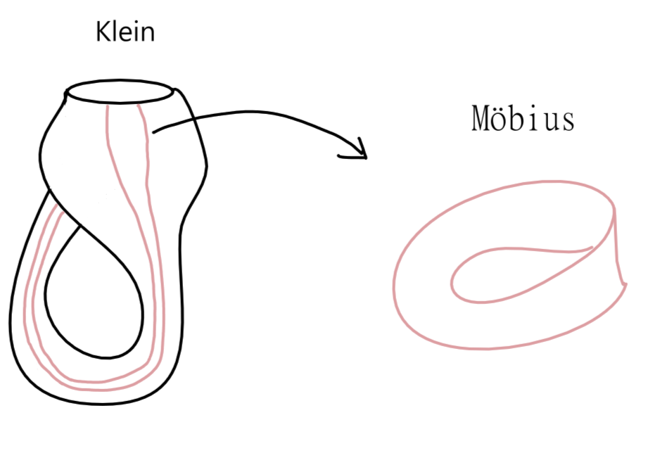
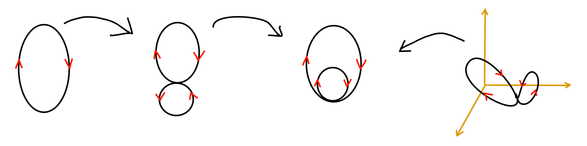

# 拓墣學的形狀
我注意到中文很少介紹到拓樸資料分析(TDA)的內容，所以想藉此機會分享給大家，這篇會對後續實際運用拓樸學來做資料分析做鋪陳，但由於要先學會一點拓樸學的資料特性以及他們的形狀，會先舉幾個經典範例。

## 形狀
首先要介紹到的是環面(Torus)，它是一個**可以在三維空間實現(fit)的二維流形(2-dim manifold)**，這句話有幾個要了解的部分。如果我們可以畫在紙上，為甚麼說在三維空間?那是因為二維空間沒有辦法完全解釋這個環面的特性，或是說當我們畫這個環面在二維空間時，雖然我們知道他的中間有**hole**，卻沒有辦法去把他表示出來，如果我們在做TDA的時候將Torus映射到二維空間，我們永遠沒有辦法在persistent homology的分析中獲取它的第二個hole，但是當我們是映射到三維空間則可以實現。

再來為甚麼說環面是二維流形，首先當我說一個形狀是manifold，它在空間中的任何一個小區域內，都可以近似為一個平面，或是可被看做歐基里德空間的一部份。所以說可以先拿一張紙(二維流形)，捲起來後再把洞口連接上形成一個Torus，該Torus也是一個2-dim manifold。

</img>

現在可以延伸到克萊因瓶(Klein bottle)，現在思考一下Klein是怎麼做出來的?它同樣可以先拿一張紙，先捲成一根管子，這次不從外面連接，而是從管子的中間穿過後連接另一端的內部。

</img>

這時出現了很有趣的部分，當你隨機獲取一條連接起來的線，會發現它是一個**莫比烏斯帶(Möbiusband)**，也就是一條很長的紙在連接的過程中轉180度的形狀(雖然沒有牽扯到第一段提到的hole，但它同樣無法在二維空間中實現它的拓樸特性)，而擴展到Klein的形狀，它並沒有辦法在三維空間被解釋，而是**可以在四維空間實現的二維流形**，因為在三維空間中看待Klein時它從中間所穿過的部分是重疊的，實際上它並沒有真正穿過自己而只是連接到的內部自己的另一端。

</img>

上述說法可能比較抽象，想像一下你將橡皮筋往內轉了一圈，得到了兩個孔洞，事實上它是在三維空間中被**扭曲**後的形狀，但是當我們從二維空間看待的時候不會知道是被扭曲，同時也因為拓樸的連通性(不可分割)而無法在二維空間將它變回一個孔的橡皮筋。回到Klein後就比較好理解其實我們看到的Klein所連接的形狀在四維空間是不同型態的，且可以被完全解釋的。

</img>

## 拓墣同調(Persistent homology)概述
在TDA的過程中我們希望找出資料空間中的特性，而拓墣同調很常被討論且延伸出很多有趣的視覺化方法，例如Barcode、Rips Diagram、Landscapes、Density Clustering等等讓我們可以分析多維空間中的**雜音或持久特徵(上述提到的hole)**，且都有在程式碼套件被介紹到。
首先要解釋一下什麼是同調，它在wiki的解釋為`是一類將一個阿貝爾群或模的序列聯繫到一個給定數學物件（如拓撲空間、群等）的過程`，而阿貝爾群(Abelian group)可以稱為可交換群，也就是對於所有滿足 ${\displaystyle a,\,b\in A}$, ${\displaystyle a\circ b=b\circ a}$，就是阿貝爾群，而當我們將這些空間聯成拓墣空間後他就會是一個同調。

通常在做拓墣同調的分析時，會將重點放在資料的**出生以及死亡**，這也是上述提到的視覺化基礎，簡單來說就是將每個資料點的半徑擴大時，同時設定觸碰到其他資料點的規則來定義出生和死亡，並作成diagram。

除了這種分析方法之外還有一種叫做Mapper Algorithm，有點像PCA的做法，例如將二維空間映射到一維的線條上，並且定義子集後分出重疊的部分，在他們各自標上顏色後做出一個Mapper graph。當我們使用PCA來看待Torus時，我們無法獲取他的hole，也就是這個資料的型態，但是當我們換成Mapper Algo卻可以有效找出它的孔洞，這就是作為拓墣資料分析一環的演算法的優點。

## Summary
由上述的內容大致介紹到拓墣資料性質以及幾個常見的資料拓墣分析方法，可以知道資料的形狀對於分析資料是有用的，雖然還沒帶到例子，但是實際上有很多[介紹](https://www.fastcompany.com/3052935/the-latest-breakthrough-in-understanding-diabetes-was-made-by-an-algorithm)TDA在糖尿病的分析內容，藉由理解數據的拓墣結構所得出的，是一種**science translational medicine**的方式。所以藉由分析點雲(point cloud)找出hole，理解資料的噪音以及特徵是很有用的，只是可能因為無法完全理解或視覺化高維空間的特徵，所以較少被討論。